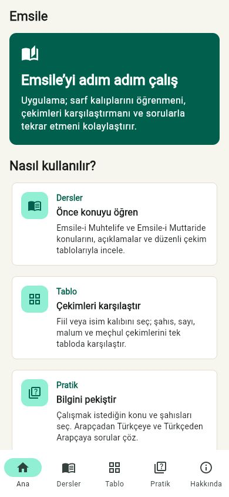
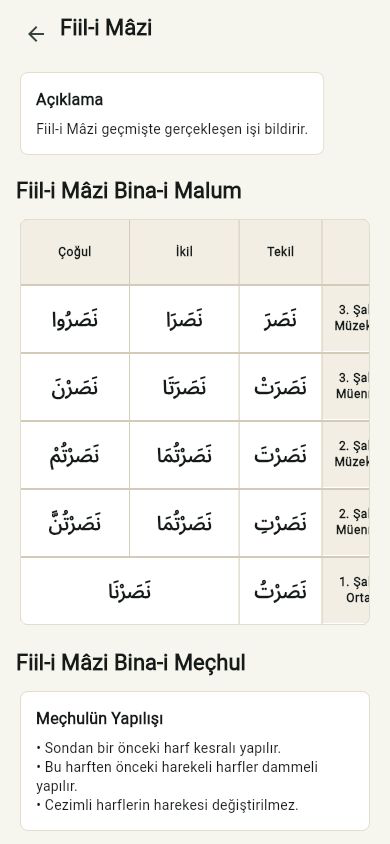
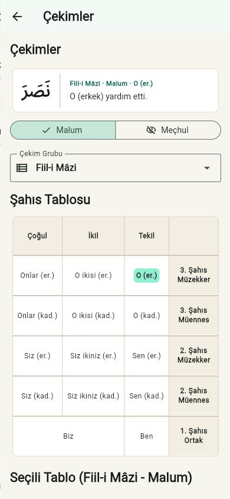
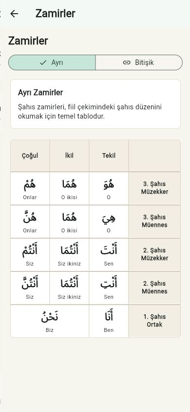
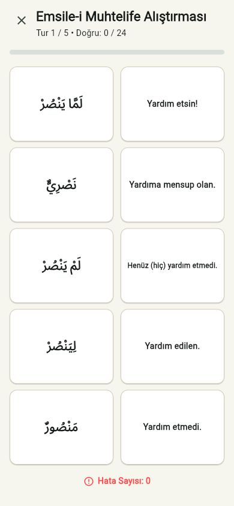
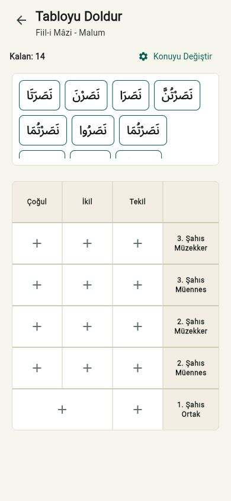

# Emsile Flutter

Mobil öncelikli Arapça sarf çalışma uygulaması.

🌐 **Canlı Demo (Web):** [karaketir16.github.io/Emsile](https://karaketir16.github.io/Emsile/)

## Ekran Görüntüleri

Uygulamanın temel öğrenme ve alıştırma akışları:

<p align="center">
  
  
  
</p>

<p align="center">
  
  
  
</p>

## Özellikler

- Muhtelife, Muttaride ve Şahıs Zamirleri dersleri
- Fiil, isim, masdar ve taaccüb kategorileri için çekim tabloları
- Ayrı ve bitişik zamir tabloları
- Filtrelenebilir çoktan seçmeli pratik
- Fiil ve isim tabloları için sürükle-bırak “Tabloyu Doldur” alıştırması
- Eşleştirme alıştırması (matching practice) modu
- Malum/meçhul, şahıs, sayı, cinsiyet ve kırık çoğul desteği

## Veri

Uygulama yerel JSON verisini kullanır:

```text
assets/data/catalog.json
assets/data/verbs/nasara.json
```

`نصر` fiilinin düzenli çekimleri çalışma anında `MuttarideGenerator` tarafından üretilir.

## Çalıştırma

```bash
flutter pub get
flutter run -d chrome
```

Farklı bir tarayıcı kullanmak için:

```bash
flutter run -d web-server
```

Terminalde gösterilen yerel adresi istediğiniz tarayıcıda açabilirsiniz.

## Kontroller

```bash
dart format lib test
flutter analyze
flutter test
flutter build web
npm run validate-seed
npm run visual-check
```

## Belgeler

- [Belge dizini](docs/README.md)
- [Uygulama denetim raporu](docs/audit-report.md)
- [Tasarım dokümanı](docs/design-document.md)
- [Düşük seviye tasarım](docs/low-level-design.md)
- [Test stratejisi](docs/testing.md)
- [Geliştirme checklist'i](docs/checklist.md)
- [Ölçeklenme planı](docs/scaling-plan.md)

## Atıf

İçerik hazırlanırken Zafer ESEN'in Emsile Ders Notu'ndan faydalanılmıştır:
[Arapça Diyarı](https://arapcadiyari.blogspot.com)

[Habbazzade'nin Arapça derslerinden](https://x.com/habbazzade)
faydalanılmıştır.
